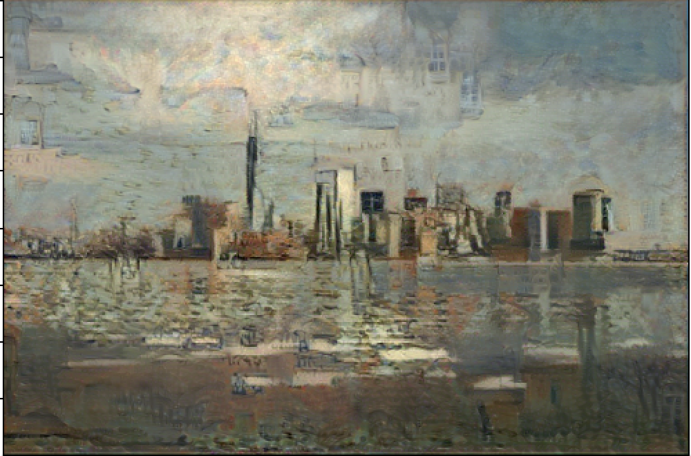

# Artistic Style Transfer using Deep Learning

<p align="center">
  
</p>

## Table of Contents
- [Introduction](#introduction)
- [Getting Started](#getting-started)
  - [Prerequisites](#prerequisites)
  - [Installation](#installation)
- [Usage](#usage)
- [Customization](#customization)
- [Results](#results)
- [Conclusion](#conclusion)
- [Acknowledgments](#acknowledgments)
- [License](#license)

## Introduction

This project implements a sophisticated deep learning model for artistic style transfer. The algorithm combines the content of a base image with the style of a reference image, resulting in visually stunning and unique compositions. The core implementation is based on the neural style transfer algorithm using the powerful VGG19 model and L-BFGS optimization.

## Getting Started

### Prerequisites

Ensure you have the following dependencies installed:

- Python 3.x
- TensorFlow
- Keras
- NumPy
- Matplotlib
- SciPy

### Installation

Clone the repository and navigate to the project directory:

```bash
git clone https://github.com/nihalk17/Dashtoon_GenAI.git
cd Dashtoon_GenAI
```

Install the required packages:

```bash
pip install -r requirements.txt
```
Download the VGG-19 model used from this link: https://drive.google.com/file/d/1VffscHZJ3j3BVjoiTUEuDfJZSU64LQVZ/view?usp=sharing

## Usage
Replace the base_image_path and style_image_path variables in the script with the paths to your desired base and style images.
The script will generate and save the final stylized image.

## Customization
Tailor the appearance of the output image by adjusting parameters such as img_nrows and img_ncols in the script.
Experiment with the number of iterations during the L-BFGS optimization for fine-tuning.

## Results
The final stylized image will be saved in the project directory. Visualize the base image, style image, and the generated image in the provided Matplotlib plots.

<p align="center">
  
</p>
<p align="center">
  
</p>
<p align="center">
  
</p>

## Conclusion
While the current implementation produces visually appealing results, there is always room for improvement. Experiment with different style images, tweak parameters, and explore alternative style transfer algorithms to achieve even more stunning visual blends.

## Acknowledgments
The code is based on the style transfer deep learning algorithm and utilizes the VGG19 model.
Original implementation: https://colab.research.google.com/drive/1EwixGVfO2s7vAqNkYB_ip9DoJt1ft9m3?usp=sharing

## License
This project is licensed under the MIT License.
